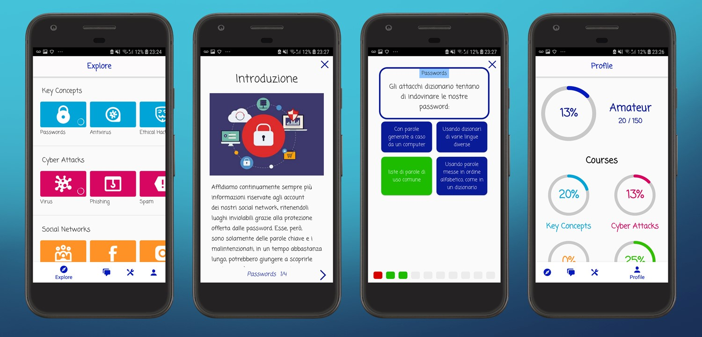
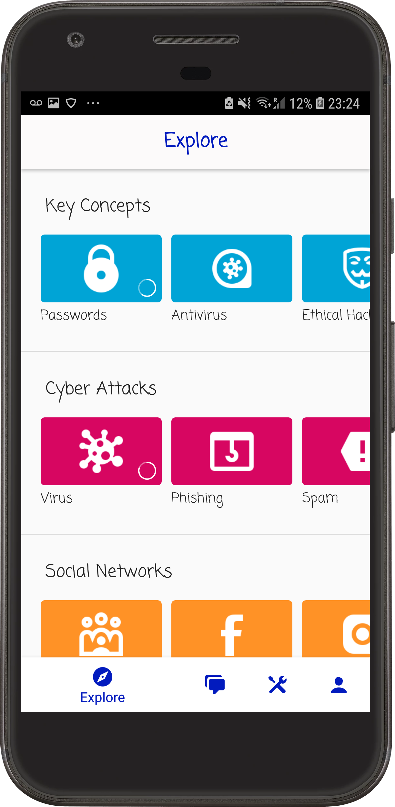
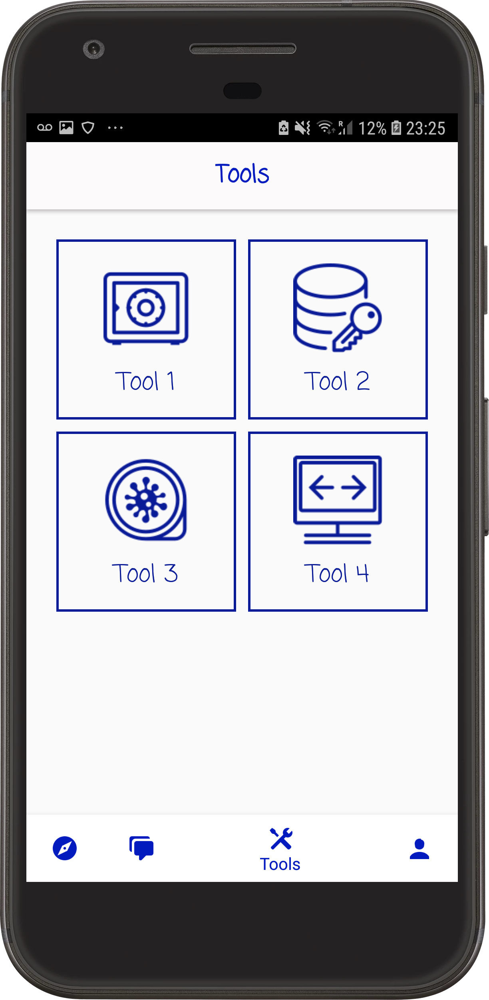
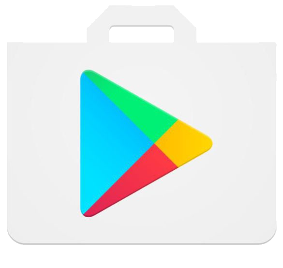

# Android Academy 

Android Academy is a template for an Android educational app, it allows you to focus on the contents of your courses in order to quickly launch your app idea. The repository is a boilerplate of an Android Studio project and includes layout files, activities control and database integration, everything already set up for you so that you can get a headstart to bring your project to life. 

The goal of this project is to provide a tool for educators to create their learning platform without spending a lot of time and resources on them and without having to have a great knowledge of Android development.

  

The template can be used freely as a whole or in part, if you do use it, we would be delighted to know it and add the link to your app in the list below. Moreover, if you extend the functionalities and you think that other educational projects would benefit, please do share them with us and we will add them to the project. 

## Table of Contents 

1. [ Overview ](#overview) 
2. [ Getting Started ](#getting-started) 
3. [ Future Extensions ](#future-extensions) 
4. [ Apps ](#apps) 
5. [ Contributors ](#contributors)

## Overview 

The app is divided into four main categories: Explore, Chat, Tools and Profile. 

### Explore 

The explore section is the one where your courses and lessons will be displayed. Each course is formed by a series of lessons. Each lesson is composed of a number of sections and a final quiz with 10 multiple choices questions at the end. 

### Chat 

The chat section will host an ad-hoc forum where users will be able to ask for help and discuss topics related to your courses. _This section is not developed yet, if you are interested check future updates._ 

### Tools 

In the tools section, you will be able to offer the user useful tools related to the contents of your courses. If you prefer this section can be easily removed, however, we strongly suggest not to because it is a good incentive for users that have completed all the currently available courses to keep the app. You can develop your own tools or go to the [tools_library](tools_library) where you will find a collection of tools that you can quickly add to your project.

### Profile

In the profile section, the user is able to track his progress in each course and his overall level. The progress of each course is calculated based on the results of the tests of the lessons in the course. Instead, you should decide the overall level division and calculation; the default one is composed by 5 levels (beginner, amateur, expert, professional and master) and supposes the presence of about 20 lessons. 

## Getting Started 

Quick guide on how to get your project going:

1. [ Personalize your app ](#personalize-your-app) 
2. [ Create the lessons database ](#create-the-lessons-database) 
3. [ Personalize the levels of the profile ](#personalize-the-levels-of-the-profile) 
4. [ Develop your tools ](#develop-your-tools) 

### Personalize your app

In order to use this project, you will need to have Android Studio installed on your computer. If you don't have it yet, use this [tutorial](https://developer.android.com/studio/install) to install it.

Clone (or download) the project and open it with Android Studio, at this point you will already have a working application that you can test on your Android (virtual or real) device. 

In order to personalize your app you should consider modifying:
* name of the app
* path of the project
* app logo
* app primary colors

### Create the lessons database

The app reads the details of the courses and lessons from an SQLite database saved locally. The first time the app is opened the database is created based on the instructions given in the lessonsdb.sql file that is stored in the assets folder.

To create the database (you can find the example with which the .sql file is created in the project repository), you can use any software you want, I recommend  [DB Browser for SQLite](https://sqlitebrowser.org/), or even write directly SQL code in the assets .sql file. With DB Browser for SQLite open the lessons.db database in the project rep, add your courses and lessons according to the schema below and then export it by going to File -> Export -> Database to SQL file -> Select the course and lesson tables -> OK -> Save it in the project assets folder with name lessonsdb.sql.

In order for the app to work automatically, you will have to keep the same tables structure and use the conventions explained in the table below.

#### Table course

| Field | Example | Explanation|
| :-------------: | :-------------: | ----- |
| \_id | `2` | Id of the course, should be autoincremented: numbers from 1 to the number of courses |
| title | `Privacy` | Name of the course, it will appear in the titles |

#### Table lesson

| Field | Example | Explanation|
| :-------------: | :-------------: | ----- |
| \_id | `3` | Id of the lesson, should be autoincremented: numbers from 1 to the number of lessons|
| courseid | `2` | Id of the course this lesson belongs to, it needs to have a corresponding entry in the course table |
| questions | `GDPR` | Name of the lesson, it will appear in the titles |
| result | `9` | Number of questions the user got correct in his best attempt of the current lesson |
| nsections | `4` | Number of sections that the current lesson is composed by |
| section0 ... section9 | `Title of the section<<-->>Text of the section` | Each of the fields contains one section, title and text of the section are separated by this `<<-->>` set of characters. If the lesson is composed by three sections only the fields 0, 1, 2 should be used and the others left empty |
| questions | `Question 1<->Correct Ans<->Wrong 1<->Wrong 2<->Wrong 3<<-->>Question 2<->T<<-->> ...` | Details of the 10 questions at the end of the lesson, questions are divided by `<<-->>`. Each question can either be: multiple choice (`Text Question<->Text Correct Answer<->Wrong Answer 1<->Wrong Answer 2<->Wrong Answer 3`) or true or false (`Text Question<->T or F`) |

#### Images

As you can see from the screenshots of the template each lesson has an icon and each section a picture. These are all saved in the app drawable folder with the following conventions:

 * __lessons' icons:__ named `z<id of the lesson>.png` (for example for the lesson with id 3 the path of the image should be _app\src\main\res\drawable\z3.png_). The icon should be a square white logo with a transparent background, suggested size ≈ 100x100 pixels.
 * __section picture:__ named `s<id of the lesson><section number>.jpg` (for example for the first section of the lesson with id 3 the path of the image should be _app\src\main\res\drawable\s30.jpg_). The image should be related to the content of the section, suggested size at least 300x200 pixels.

The color of each course can be changed in the `CoursesColors` array in the Preferences.java file.

The last thing you have to do is increment by one the database version in the LessonsLDH class. Remember this step whenever you modify the dataset. Now open your app on an Android device and all your courses should be working!

### Personalize the levels of the profile

The default division of the levels is beginner, amateur (from 100 points), expert (from 250), professional (from 450) and master (from 700). The points are calculated based on the end of lesson test results, for each of these the best score (number of questions correct) is multiplied by 5 and summed altogether.

The number, names and bounds of the levels can be changed in the Preferences.java file, where they are determined by two constant arrays: `LEVELS` defines the names and `BOUNDARIES` defines the score at which the user reaches that level. It is important that the arrays have the same size and that the score array is in ascending order (i.e. from the first to the last level).

### Develop your tools

This is the only part of the app you will have to develop yourself, if you prefer this section can be easily removed, however, we strongly suggest not to because it is a good incentive for users that have completed all the currently available courses to keep the app. This repository also offers a [collection of shared tools](tools_library) that you can easily add to your project.

Tools are accessed from a table present in the ToolsActivity and can be developed as an independent set of activities or even just a dialog that is opened in the Tools Activity. 

For examples on how you can develop a tool, see the [tools library](tools_library).

## Future Extensions 

The following list contains the future extensions that we have in plan to develop:
* chat section: a forum where users will be able to ask for help and discuss topics related to your courses;
* integrate the possibility to display YouTube videos (in the place of photos) in the lessons;
* create a login process and save the profiles online so users can browse and see their friends progresses;
* create a form in the app where users can directly propose new lessons that you will, then, have to approve;

If you have ideas of other functionalities or tools that you think that might be useful please write them to us and we will add them to the roadmap.

If you have the chance to develop a functionality or tool not yet present in the template, please do share it with us and we will add it giving you the credits.

## Apps 

Here you can have a look at some of the apps that have used this template and hopefully soon there will be yours too: 

  

  

* __Cyber Academy:__ become an expert in cybersecurity with interactive lessons and quizzes! The app also offers tools such as a password manager to keep all your passwords safely in one place.

### Contributors:

* [Gabriele Corso](https://github.com/gcorso)
* [Charles Johnson](https://github.com/cehjohnson)
* [Alessandro Corso](https://github.com/AleCorso)

### Contact

If you have any question or you would like to contribute to the project, please contact me using GitHub services or write an email at gcappslab@gmail.com.
